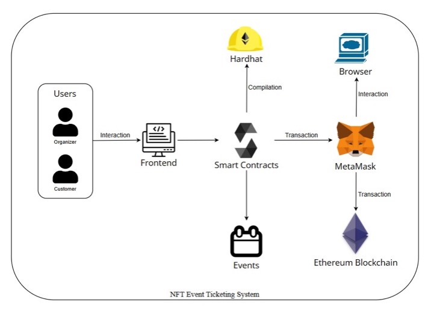

# 🎟️ NFT Event Ticketing System

A decentralized event ticketing system using NFTs to ensure secure, transparent, and tamper-proof ticket issuance, validation, and ownership transfer on the blockchain.

---

## 📌 Table of Contents

- [Overview](#-overview)
- [Features](#-features)
- [Technologies Used](#-technologies-used)
- [System Architecture](#-system-architecture)
- [Smart Contracts](#-smart-contracts)
- [Getting Started](#-getting-started)
- [Project Structure](#-project-structure)
- [Future Improvements](#-future-improvements)


---

## 📖 Overview

The **NFT Event Ticketing System** is a full-stack decentralized application (dApp) that allows event organizers to mint NFT-based tickets and users to securely purchase and verify them on the Ethereum blockchain. This project solves issues like fraud, ticket scalping, and loss of proof-of-purchase through the transparency and immutability of blockchain technology.

---

## ✅ Features

- 🎫 Mint NFT tickets for events
- 👤 Organizer and attendee roles
- 🔒 Secure blockchain-based ticket verification
- 🔄 Resell and transfer tickets with ownership tracking
- 🖼️ Metadata support (images, descriptions)
- 📦 Smart contract deployment using Hardhat

---

## 💻 Technologies Used

| Layer        | Tech Stack                                 |
|--------------|---------------------------------------------|
| Smart Contract | Solidity, Hardhat                        |
| Backend      | Node.js, JavaScript                        |
| Frontend     | React.js, Ethers.js                        |
| Blockchain   | Ethereum (testnet)                         |
| Deployment   | IPFS (for assets), MetaMask, Infura        |
| Others       | Web3.js, OpenZeppelin, NFT.storage         |

---

## 🏗️ System Architecture

<p align="center">
  
</p>

- **Frontend** interacts with users through MetaMask.
- **Smart contracts** manage ticket minting, transfer, and ownership.
- **Blockchain** provides verifiability and decentralization.

---

## 🔐 Smart Contracts

The system includes two main contracts:

1. **Event.sol**  
   - Handles event creation and metadata.

2. **NFTticketing.sol**  
   - Handles NFT ticket minting, verification, and transfer.

Contracts are written in **Solidity**, compiled and tested using **Hardhat**.

---

## 🚀 Getting Started

### Prerequisites

- [Node.js](https://nodejs.org/)
- [MetaMask](https://metamask.io/)
- [Hardhat](https://hardhat.org/)
- [Ganache CLI](https://trufflesuite.com/ganache/)
- Git

### Setup Instructions

```bash
# Clone the repo
git clone https://github.com/Amena15/nft-event-ticketing-system.git
cd nft-event-ticketing-system

# Install backend dependencies
cd backend
npm install

# Compile smart contracts
npx hardhat compile

# Run local blockchain
npx hardhat node

# Deploy smart contracts
npx hardhat run scripts/deploy.js --network localhost
````

### Frontend Setup

*Go to the `frontend` folder (inside this repo) and follow its own README if available.*

---

## 📁 Project Structure

```
nft-event-ticketing-system/
│
├── backend/
│   ├── contracts/
│   │   ├── Event.sol
│   │   └── NFTticketing.sol
│   ├── scripts/
│   │   └── deploy.js
│   ├── hardhat.config.js
│   └── package.json
│
├── frontend/
│   └── (React app files)
│
├── img/
│   ├── Ghibli.png
│   └── Coachella.jpeg
│
├── instructions.txt
└── README.md
```

---

## 🔮 Future Improvements

*  QR code verification system
*  Ticket resale marketplace
*  IPFS integration for storing ticket metadata
*  Admin dashboard for event organizers
*  Role-based access control (RBAC)


